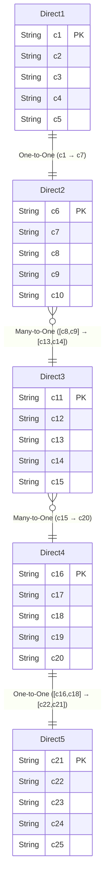

有时候我们会有一张中间表来做多对多的关系,但是这张中间表是没有任何意义的,甚至是多张表,但是如果我们使用正常的导航属性那么在使用的时候需要多级使用才可以

比如:`where(o->o.a().b().c().name().like("123"))`有时候`a、b、c`只是中间表不需要进行任何处理所以希望在使用的时候写法改成`where(o->o.c().name()).like("123"))`


::: tabs
@tab 关系图


@tab 关系图


@tab Direct1
```java

@Data
@Table("direct1")
@EntityProxy
public class Direct1 implements ProxyEntityAvailable<Direct1 , Direct1Proxy> {
    @Column(primaryKey = true)
    private String c1;
    private String c2;
    private String c3;
    private String c4;
    private String c5;

    @Navigate(value = RelationTypeEnum.OneToOne, selfProperty = {Direct1Proxy.Fields.c1}, targetProperty = {Direct2Proxy.Fields.c7})
    private Direct2 direct2;


    @Navigate(value = RelationTypeEnum.ManyToOne,directMapping = {"direct2","direct3","direct4"})
    private Direct4 direct4;

    @Navigate(value = RelationTypeEnum.ManyToOne,directMapping = {"direct2","direct3","direct4","direct5"})
    private Direct5 direct5;
}
```
@tab Direct2
```java

@Data
@Table("direct2")
@EntityProxy
public class Direct2 implements ProxyEntityAvailable<Direct2, Direct2Proxy> {
    @Column(primaryKey = true)
    private String c6;
    private String c7;
    private String c8;
    private String c9;
    private String c10;

    @Navigate(value = RelationTypeEnum.ManyToOne,
            selfProperty = {Direct2Proxy.Fields.c8, Direct2Proxy.Fields.c9},
            targetProperty = {Direct3Proxy.Fields.c13, Direct3Proxy.Fields.c14})
    private Direct3 direct3;
}

```

@tab Direct3
```java
@Data
@Table("direct3")
@EntityProxy
public class Direct3 implements ProxyEntityAvailable<Direct3, Direct3Proxy> {
    @Column(primaryKey = true)
    private String c11;
    private String c12;
    private String c13;
    private String c14;
    private String c15;

    @Navigate(value = RelationTypeEnum.ManyToOne, selfProperty = {Direct3Proxy.Fields.c15}, targetProperty = {Direct4Proxy.Fields.c20})
    private Direct4 direct4;
}

```

@tab Direct4
```java
@Data
@Table("direct4")
@EntityProxy
public class Direct4 implements ProxyEntityAvailable<Direct4, Direct4Proxy> {
    @Column(primaryKey = true)
    private String c16;
    private String c17;
    private String c18;
    private String c19;
    private String c20;

    @Navigate(value = RelationTypeEnum.OneToOne, selfProperty = {Direct4Proxy.Fields.c16, Direct4Proxy.Fields.c18}, targetProperty = {Direct5Proxy.Fields.c22, Direct5Proxy.Fields.c21})
    private Direct5 direct5;
}


```
@tab Direct5
```java
@Data
@Table("direct5")
@EntityProxy
public class Direct5 implements ProxyEntityAvailable<Direct5, Direct5Proxy> {
    @Column(primaryKey = true)
    private String c21;
    private String c22;
    private String c23;
    private String c24;
    private String c25;
}

```

:::