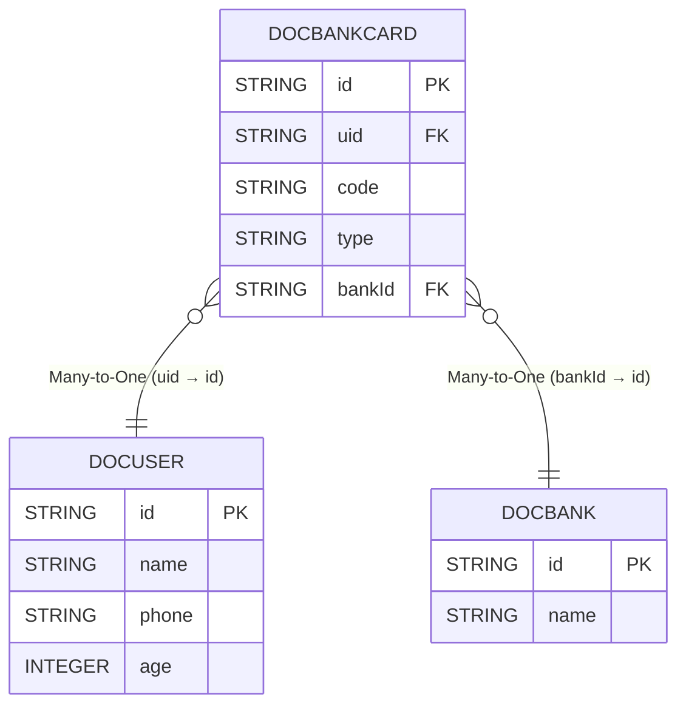

# 快速连表
`eq`与常规orm不同，连表支持`显式join`和`隐式join`对于常规的业务操作我们认为各个表之间的数据不是孤单数据,所以在90%的场景下任意两张表之间进行join那么使用on条件应该是相同的，我们把这种相同的条件通过面向对象的形式将其配置到对象属性上面，这种行为我们称其为导航属性，导航属性又是我们常说的对象关系,常见的对象关系拥有`一对一`、`一对多`、`多对一`、`多对多`,各个属性分别在数据库实体对象上以单个对象属性亦或者是集合属性展示

`eq`支持将这种对象关系转换成数据库sql语法表达式来进行数据的查询,通过面向对象的方式编写`dsl`屏蔽复杂的数据库语句转而以开发者方便阅读的形式来进行业务代码的编写。

## 建立对象关系
首先我们建立一个相对简单的用户模型来描述目前的对象关系
- 用户 `DocUser`
- 银行卡 `DocBankCard`
- 银行 `DocBank`
我们目前有这三张表分别是每个银行有对应的银行卡，并且每个用户有对应的银行卡,用户和银行卡一对多,银行和银行卡也是一对多,用户和银行通过银行卡可以实现多对多关系


::: tabs
@tab 关系图



@tab DocUser
```java

@Table("doc_user")
@EntityProxy
@Data
@EasyAlias("user")
public class DocUser implements ProxyEntityAvailable<DocUser , DocUserProxy> {
    @Column(primaryKey = true)
    private String id;
    private String name;
    private String phone;
    private Integer age;

    @Navigate(value = RelationTypeEnum.OneToMany, selfProperty="id",targetProperty = "uid")
    private List<DocBankCard> bankCards;
}
```

@tab DocBankCard
```java

@Table("doc_bank_card")
@EntityProxy
@Data
@EasyAlias("bank_card")
public class DocBankCard implements ProxyEntityAvailable<DocBankCard, DocBankCardProxy> {
    @Column(primaryKey = true)
    private String id;
    private String uid;
    /**
     * 银行卡号
     */
    private String code;
    /**
     * 银行卡类型借记卡 储蓄卡
     */
    private String type;
    /**
     * 所属银行
     */
    @ForeignKey
    private String bankId;

    @Navigate(value = RelationTypeEnum.ManyToOne, selfProperty = "uid",targetProperty="id")
    private DocUser user;


    @Navigate(value = RelationTypeEnum.ManyToOne, selfProperty = "bankId",targetProperty="id")
    private DocBank bank;
}

```

@tab DocBank
```java

@Table("doc_bank")
@EntityProxy
@Data
@EasyAlias("bank")
public class DocBank implements ProxyEntityAvailable<DocBank, DocBankProxy> {
    @Column(primaryKey = true)
    private String id;
    private String name;

    @Navigate(value = RelationTypeEnum.OneToMany, selfProperty="id", targetProperty = "bankId")
    private List<DocBankCard> bankCards;
}
```

:::

## 隐式join
查询银行卡 条件银行卡的所属用户姓名叫小明
```java

List<DocBankCard> list = easyEntityQuery.queryable(DocBankCard.class)
        .where(bank_card -> {
            bank_card.user().name().eq("小明");
        }).toList();

==> Preparing: SELECT t.`id`,t.`uid`,t.`code`,t.`type`,t.`bank_id` FROM `doc_bank_card` t LEFT JOIN `doc_user` t1 ON t1.`id` = t.`uid` WHERE t1.`name` = ?
==> Parameters: 小明(String)
```

查询银行卡 条件银行卡的所属用户手机号包含`1234`并且银行卡是工商银行的
```java

List<DocBankCard> list1 = easyEntityQuery.queryable(DocBankCard.class)
        .where(bank_card -> {
            bank_card.user().phone().like("1234");
            bank_card.bank().name().eq("工商银行");
        }).toList();

==> Preparing: SELECT t.`id`,t.`uid`,t.`code`,t.`type`,t.`bank_id` FROM `doc_bank_card` t LEFT JOIN `doc_user` t1 ON t1.`id` = t.`uid` INNER JOIN `doc_bank` t2 ON t2.`id` = t.`bank_id` WHERE t1.`phone` LIKE ? AND t2.`name` = ?
==> Parameters: %1234%(String),工商银行(String)
```
查询小明在工商银行的银行卡信息返回`[姓名|所属银行|卡号]` 按卡号正序排列

```java
List<Draft3<String, String, String>> list2 = easyEntityQuery.queryable(DocBankCard.class)
                .where(bank_card -> {
                    bank_card.user().name().eq("小明");
                    bank_card.bank().name().eq("工商银行");
                })
                .orderBy(bank_card -> bank_card.code().asc())
                .select(bank_card -> Select.DRAFT.of(
                        bank_card.user().name(),
                        bank_card.bank().name(),
                        bank_card.code()
                )).toList();


==> Preparing: SELECT t1.`name` AS `value1`,t2.`name` AS `value2`,t.`code` AS `value3` FROM `doc_bank_card` t LEFT JOIN `doc_user` t1 ON t1.`id` = t.`uid` INNER JOIN `doc_bank` t2 ON t2.`id` = t.`bank_id` WHERE t1.`name` = ? AND t2.`name` = ? ORDER BY t.`code` ASC
==> Parameters: 小明(String),工商银行(String)
```


## 超强筛选🔥🔥🔥
筛选出用户拥有至少2张工商银行的银行卡并且还未在建设银行开户的用户
```java

List<DocUser> list = easyEntityQuery.queryable(DocUser.class)
        .where(user -> {
            user.bankCards().where(card -> {
                card.bank().name().eq("工商银行");
            }).count().ge(2L);

            user.bankCards().none(card -> {
                card.bank().name().eq("建设银行");
            });
        }).toList();


-- 第1条sql数据
SELECT
    t.`id`,
    t.`name`,
    t.`phone`,
    t.`age` 
FROM
    `doc_user` t 
WHERE
    (
        SELECT
            COUNT(*) 
        FROM
            `doc_bank_card` t1 
        INNER JOIN
            `doc_bank` t2 
                ON t2.`id` = t1.`bank_id` 
        WHERE
            t1.`uid` = t.`id` 
            AND t2.`name` = '工商银行'
    ) >= 2 
    AND NOT ( EXISTS (SELECT
        1 
    FROM
        `doc_bank_card` t3 
    INNER JOIN
        `doc_bank` t4 
            ON t4.`id` = t3.`bank_id` 
    WHERE
        t3.`uid` = t.`id` 
        AND t4.`name` = '建设银行' LIMIT 1))
```

很多小伙伴认为就是因为orm生成的sql不行导致性能不行那么我们看`eq`最最最最最牛逼的子查询合并`隐式group又称manyJoin`

还是上述条件

筛选出用户拥有至少2张工商银行的银行卡并且还未在建设银行开户的用户

```java

List<DocUser> list = easyEntityQuery.queryable(DocUser.class)
        .manyJoin(u->u.bankCards())//启用隐式group也被叫做manyJoin
        .where(user -> {
            //至少2张工商银行
            user.bankCards().where(card -> {
                card.bank().name().eq("工商银行");
            }).count().ge(2L);

            //没有建行卡
            user.bankCards().none(card -> {
                card.bank().name().eq("建设银行");
            });
        }).toList();


-- 第1条sql数据
SELECT
    t.`id`,
    t.`name`,
    t.`phone`,
    t.`age` 
FROM
    `doc_user` t 
LEFT JOIN
    (
        SELECT
            t1.`uid` AS `uid`,
            COUNT((CASE WHEN t3.`name` = '工商银行' THEN 1 ELSE null END)) AS `__count2__`,
            (CASE WHEN COUNT((CASE WHEN t3.`name` = '建设银行' THEN 1 ELSE null END)) > 0 THEN false ELSE true END) AS `__none3__` 
        FROM
            `doc_bank_card` t1 
        INNER JOIN
            `doc_bank` t3 
                ON t3.`id` = t1.`bank_id` 
        GROUP BY
            t1.`uid`
    ) t2 
        ON t2.`uid` = t.`id` 
WHERE
    IFNULL(t2.`__count2__`,0) >= 2 
    AND IFNULL(t2.`__none3__`,true) = true        
```

使用数据库分析可以让原本10秒的双子查询迅速优化到只需要100ms,并且最重要的一点是比原生sql的可读性强百倍

## 动态join
查询银行卡条件可以传入持卡人姓名或者不传入来筛选结果

以下查询支持动态join,有查询条件那么会自动join用户表否则不会进行join真正做到了`智能orm`
```java

String queryName=null;
List<DocBankCard> xmCards = easyEntityQuery.queryable(DocBankCard.class)
        //如果查询条件不符合那么将不会加入到条件中
        .filterConfigure(NotNullOrEmptyValueFilter.DEFAULT)
        .where(bank_card -> {
            bank_card.user().name().eq(queryName);
        })
        .toList();

==> Preparing: SELECT t.id,t.uid,t.code,t.type,t.bank_id FROM doc_bank_card t
```

## 混合join
`eq`不单单支持`显式join`,还支持`隐式join`并且最最最重要的是支持`显式+隐式混合使用`这是其他orm做不到的
```java


List<Draft3<String, String, String>> result = easyEntityQuery.queryable(DocBankCard.class)
        .filterConfigure(NotNullOrEmptyValueFilter.DEFAULT)
        .leftJoin(DocBank.class,(bank_card, bank) -> bank_card.bankId().eq(bank.id()))
        .where((bank_card, bank) -> {
            bank_card.user().name().eq("小明");
        })
        .select((bank_card, bank) -> Select.DRAFT.of(
                bank_card.code(),
                bank_card.user().name(),
                bank.name()
        )).toList();


==> Preparing: SELECT t.code AS value1,t2.name AS value2,t1.name AS value3 FROM doc_bank_card t INNER JOIN doc_bank t1 ON t.bank_id = t1.id LEFT JOIN doc_user t2 ON t2.id = t.uid WHERE t2.name = ?
==> Parameters: 小明(String)
```
